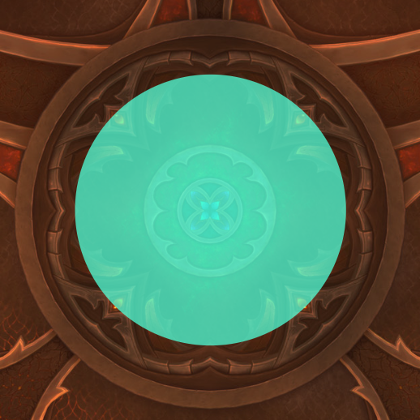
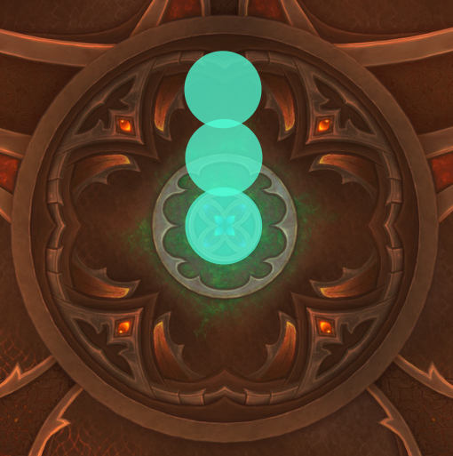

import { Tabs } from 'nextra/components';
import { Callout } from 'nextra/components';
import { Steps } from 'nextra/components';

<Callout type='info'>
  Check out [how to use this guide](/#how-to-use-this-guide) for help parsing
  the info on this page.
</Callout>

## Resources

|        | Link                                                                                                                                  | Link B                                                                         | Link C                                                                          | Link D                                                                       |
| :----- | :------------------------------------------------------------------------------------------------------------------------------------ | :----------------------------------------------------------------------------- | :------------------------------------------------------------------------------ | :--------------------------------------------------------------------------- |
| Logs   | [All logs](https://www.warcraftlogs.com/zone/reports?zone=35&boss=2731&difficulty=0&class=Any&spec=Any&keystone=0&kills=2&duration=0) | [Heroic log](https://www.warcraftlogs.com/reports/fwZzjpRCbKXAPW3L#fight=last) | [Heroic log](https://www.warcraftlogs.com/reports/ZhD73mykr4dBwp1F#fight=last)  | [Mythic log](https://www.warcraftlogs.com/reports/8pdfXKqAMZWy1wRk#fight=19) |
| Videos | [Heroic guide video](https://www.youtube.com/watch?v=23-Ky5MfyNk)                                                                     | [Mythic testing video](https://www.youtube.com/watch?v=bg9lVMYWXuI)            | [Mythic testing video](https://youtu.be/Xl-YWAjGuuM?si=0lmQahLIv1kR09O5&t=1867) |                                                                              |
| Misc   | [One-sheet](https://questionablyepic.com/amirdrassil-the-dreams-hope-raid/larodar/)                                                   |                                                                                |                                                                                 |

| Datum           | Description     |
| :-------------- | :-------------- |
| 1st potion      | On pull         |
| 2nd potion      | Phase 2 / ASAP  |
| Lust            | Phase 2         |
| Utility talents | CCs / AoE stops |

## Overview

Larodar is a 2-phase, healing-centric fight that focuses on area denial and raid communication.

Phase 1 has a repeating pattern up to three times based on the boss's energy.  It's all about managing the **Seed of Life** to keep the arena clear and safe.  **Fiery Treants** spawn that must be killed and healed back to full so they empower the central **Seed of Life**.  Assigned players use the **Seed** to clear fire around the room and allow the raid to kill [Scorching Roots](https://www.wowhead.com/ptr-2/spell=417660/scorching-roots?dd=15), which keep us safe during the [Raging Inferno](https://www.wowhead.com/ptr-2/spell=417634/raging-inferno?dd=15) the boss casts at full energy.  Then this process repeats up to two more times.

After the third [Raging Inferno](https://www.wowhead.com/ptr-2/spell=417634/raging-inferno?dd=15) (or when the boss reaches 40% HP), Phase 2 begins.

Phase 2 begins with a massive [Consuming Flame](https://www.wowhead.com/spell=421316/consuming-flame?dd=15) raid-wide AoE, then we're in a soft-enrage scenario to defeat Larodar before the room is too full of fire from his abilities and the CCable **Ashen Treants** spawns.

Overall order of events:

| Timestamp | Event                                                                               | Count | Note                                                      |
| :-------- | :---------------------------------------------------------------------------------- | :---- | :-------------------------------------------------------- |
| 00:00     | **Phase 1**                                                                         |       |                                                           |
| 00:05     | **Fiery Treants**                                                                   | 1     | Tank at boss, DPS kill, and healers heal                  |
| 00:40     | [Scorching Roots](https://www.wowhead.com/ptr-2/spell=417660/scorching-roots?dd=15) | 1     | Kite roots                                                |
| 00:45     | **Seed of Life**                                                                    | 1     | Seed team 1 hit Roots & patches                           |
| 01:45     | [Raging Inferno](https://www.wowhead.com/ptr-2/spell=417634/raging-inferno?dd=15)   | 1     | Stack in **Renewed Bramble Barrier** and healers raid CDs |
| 02:05     | **Fiery Treants**                                                                   | 2     | Tank at boss, DPS kill, and healers heal                  |
| 02:40     | [Scorching Roots](https://www.wowhead.com/ptr-2/spell=417660/scorching-roots?dd=15) | 2     | Kite roots                                                |
| 02:45     | **Seed of Life**                                                                    | 2     | Seed team 2 hit Roots & patches                           |
| 03:35     | [Raging Inferno](https://www.wowhead.com/ptr-2/spell=417634/raging-inferno?dd=15)   | 2     | Stack in **Renewed Bramble Barrier** and healers raid CDs |
| 03:55     | **Fiery Treants**                                                                   | 3     | Tank at boss, DPS kill, and healers heal                  |
| 04:40     | [Scorching Roots](https://www.wowhead.com/ptr-2/spell=417660/scorching-roots?dd=15) | 3     | Kite roots                                                |
| 04:45     | **Seed of Life**                                                                    | 3     | Seed team 3 hit Roots & patches                           |
| 05:25     | [Raging Inferno](https://www.wowhead.com/ptr-2/spell=417634/raging-inferno?dd=15)   | 3     | Stack in **Renewed Bramble Barrier** and healers raid CDs |
| 05:30     | **Phase 2**                                                                         |       |                                                           |

### Key mechanics

**Phase 1**

- **Fiery Treants** - Spawn at the start of the fight and after every [Raging Inferno](https://www.wowhead.com/ptr-2/spell=417634/raging-inferno?dd=15) cast.  They must be tanked and killed, then healed back to full health to transform into **Renewed Treants**.
  - @tactic Tanks should pick up **Fiery Treants** and get them into cleave range of the boss ASAP.  Healers should heal **Charred Treants** ASAP.
- [Scorching Roots](https://www.wowhead.com/ptr-2/spell=417660/scorching-roots?dd=15) - Spawn at ~30 energy and fixate on a random player.
  - @tactic Must be kited and killed.
- [Seed of Life](https://www.wowhead.com/ptr-2/spell=424997/seed-of-life?dd=15) - Gains energy from **Renewed Treants** channeling [Nature's Gift](https://www.wowhead.com/ptr-2/spell=424997/natures-gift?dd=15) into it.  Interacting with the **Seed** allows you to clear Burning Ground patches and lets the raid kill **Scorching Roots**. A private circle indicator appears, showing the maximum distance the player can move away from the **Seed** before breaking their tether.
  - @tactic See the **Phase 1 > Seed of Life** tab for assignments.
- [Raging Inferno](https://www.wowhead.com/ptr-2/spell=417634/raging-inferno?dd=15) - Cast at 100 energy, dealing massive raid-wide damage.  This damage is reduced by 90% while standing within the radius of a **Renewed Bramble Barrier** (a killed them healed **Scorching Roots**), which applies the [Nature's Bulwark](https://www.wowhead.com/ptr-2/spell=419485/natures-bulwark) debuff.
  - @tactic Everyone must stack within the radius of a **Renewed Bramble Barrier** during [Raging Inferno](https://www.wowhead.com/ptr-2/spell=417634/raging-inferno?dd=15) casts.
- [Blazing Coalescence](https://www.wowhead.com/ptr-2/spell=426242/blazing-coalescence) spawns a handful of orbs that move toward Larodar.  Soaking these orbs applies a moderate DoT over 10 seconds, but increases critical strike chance by 20%.
  - @tactic DPS should soak these orbs to increase their damage output.  Use a personal CD for the initial hit.
- Tank @countdown [Furious Charge](https://www.wowhead.com/ptr-2/spell=418637/furious-charge?dd=15) - Cast on the current tank, causing the boss to charge to the current tank location after 4 seconds, dealing damage to anyone in his path and dealing raid-wide damage, reduced by distance from the boss.
  - @tactic The current tank should run directly out into the existing fire when [Furious Charge](https://www.wowhead.com/ptr-2/spell=418637/furious-charge?dd=15) is being cast.

**Phase 2**

- [Consuming Flame](https://www.wowhead.com/spell=421316/consuming-flame?dd=15) - Massive raid-wide AoE at the start of Phase 2.
  - @tactic Healers should be ready with significant raid healing & CDs.
- [Falling Embers](https://www.wowhead.com/spell=427252/falling-embers?dd=15) - Every ~25 seconds, Larodar creates 4-5 small circle locations around the room that deal minor damage to players within the radius.  Failing to soak a puddle applies [Searing Ash](https://www.wowhead.com/spell=421323/searing-ash?dd=15) to the entire raid.
  - @tactic The raid should spread out and ensure at least one player is in every puddle soak.
- [Ashen Call](https://www.wowhead.com/spell=422461/ashen-call?dd=15) - Every ~45 seconds, Larodar summons a ring of **Ashen Treants** around the outside of the room.  These are fully CCable and attackable and will fixate on random players. Upon death, they cast [Explosive Bark](http://www.wowhead.com/spell=418535?dd=15) within 3 yards and, more importantly, spawn a [Burning Ground](http://www.wowhead.com/spell=417632?dd=15) patch at their location.
  - @tactic Ranged DPS use knocks and CCs to keep the **Ashen Treants** away from the raid, then kill them ASAP. 
- Tank @countdown [Smoldering Backdraft](https://www.wowhead.com/spell=421318/smoldering-backdraft?dd=15) - Larodar deals massive cleave damage and applies [Smoldering Suffocation](https://www.wowhead.com/spell=421594/smoldering-suffocation?dd=15) to the current tank.  This reduces direct healing by 100% and applies a DoT over 30 seconds.
  - @tactic Tanks **MUST** keep the boss facing the outside of the room when this cleave hits, then taunt swap immediately afterward.
  - The [Smoldering Suffocation](https://www.wowhead.com/spell=421594/smoldering-suffocation?dd=15) tank should stack on the raid to leech their health to counteract the DoT.

## Strategy

### Phase 1

<Callout type="warning">Select the tabs below to view each section.</Callout>

<Tabs items={['Fiery Treants', 'Seed of Life', 'Raging Inferno and Scorching Roots', 'Tanking & Furious Charge']}>
  <Tabs.Tab>
  
  At the start of the fight and after every [Raging Inferno](https://www.wowhead.com/ptr-2/spell=417634/raging-inferno?dd=15) cast, Larodar summons a set of three **Fiery Treants** that can be tanked and killed.  When killed, they transform into **Charred Treants** that can be healed.  When healed to full, they transform into **Renewed Treants** that channel [Nature's Gift](https://www.wowhead.com/ptr-2/spell=424997/natures-gift?dd=15) into the **Seed of Life**, increasing the **Seed's** energy up to a maximum of 100.

  While active, **Fiery Treants** will cast [Fiery Flourish](https://www.wowhead.com/ptr-2/spell=426524/fiery-flourish?dd=15), which deals AoE damage to nearby players.  When **Fiery Treants** die, they cast [Explosive Bark](https://www.wowhead.com/ptr-2/spell=418535/explosive-bark?dd=15), hitting players within 3 yards of their corpse.

  <Tactic full />

  - Tanks should pick up **Fiery Treants** and get them into cleave range of the boss ASAP.
    - Death Knights can use [Death Grip](https://www.wowhead.com/spell=191650/death-grip) / [Gorefiend's Grasp](https://www.wowhead.com/spell=108199/gorefiends-grasp) to pull **Fiery Treants** into range quickly.
    - **Fiery Treants** will stack [Blistering Splinters](https://www.wowhead.com/ptr-2/spell=418522/blistering-splinters?dd=15) on their target, dealing stacking fire damage over time.
  - DPS should cleave off of **Fiery Treants** until they're dead.
  - @interrupt the [Fiery Flourish](https://www.wowhead.com/ptr-2/spell=426524/fiery-flourish?dd=15) casts.
  - Healers should heal **Charred Treants** to full health, at which point they'll transform into **Renewed Treants** and automatically make their way to the **Seed of Life**.
  - Melee should stand at max range to avoid taking damage from [Explosive Bark](https://www.wowhead.com/ptr-2/spell=418535/explosive-bark?dd=15) when **Fiery Treants** die. 
  
  </Tabs.Tab>
  <Tabs.Tab>

  When **Renewed Treants** channel [Nature's Gift](https://www.wowhead.com/ptr-2/spell=424997/natures-gift?dd=15) into the **Seed of Life** it slowly gains energy.  At any time, any player can interact with the **Seed of Life** to gain the [Dream Blossom](https://www.wowhead.com/ptr-2/spell=425468/dream-blossom) debuff.  This forms a tether between the **Seed of Life** and the player.  A private circle indicator also appears, showing the maximum distance the player can move away from the **Seed of Life** before breaking their tether.
  
  While the **Seed of Life** has energy, any tethered player will automatically shoot a conal attack in front of their character that has two effects:

  - It douses any [Burning Ground](https://www.wowhead.com/ptr-2/spell=417632/burning-ground?dd=15) it hits and removes the fire patch.
  - It makes the active [Scorching Roots](https://www.wowhead.com/ptr-2/spell=417660/scorching-roots?dd=15) attackable and killable.

  <Callout>On Heroic/Mythic difficulties, tethered players gain [Dream Fatigue](https://www.wowhead.com/ptr-2/spell=425531/dream-fatigue?dd=15), which prevents future tethering for the remainder of the fight.</Callout>

  <Callout type="info">Select the difficulty below to see how far the tether extends and some example clips of the tether in action.</Callout>

  <Tabs items={['Normal tether range', 'Heroic tether range', 'Mythic tether range']}>
    <Tabs.Tab>

    

    - Normal/Heroic **Seed of Life** example: https://youtu.be/ETXjANS_SDs?si=8AF4Dj2impEvaBfT&t=61
    - Normal/Heroic **Seed of Life** example: https://youtu.be/J6drlgbLjW8?t=155

    </Tabs.Tab>
    <Tabs.Tab>

    

    - Normal/Heroic **Seed of Life** example: https://youtu.be/ETXjANS_SDs?si=8AF4Dj2impEvaBfT&t=61
    - Normal/Heroic **Seed of Life** example: https://youtu.be/J6drlgbLjW8?t=155

    </Tabs.Tab>
    <Tabs.Tab>

    

    <Callout type="warning">
    Note that Mythic difficulty requires *three* people to be tethered to the **Seed of Life**.
    </Callout>

    - Mythic **Seed of Life** example: https://youtu.be/Xl-YWAjGuuM?t=2039
    - Mythic **Seed of Life** example: https://youtu.be/pEV7NUkxqCA?t=54
    - Mythic **Seed of Life** example: https://youtu.be/kr1jAOoj9-U?t=268

    </Tabs.Tab>        
  </Tabs>

  <Tactic full />

  There are a few general rules of thumb for **Seed of Life** tethering:
  
  - @critical Prioritize targeting the active **Scorching Roots** with your conal attack.
    - The **Roots** must be killed and healed back to full before Larodar reaches 100 energy.
  - If there are no **Scorching Roots** active, target the *largest, centralized* **Burning Ground** patches.
  - Never allow the **Seed of Life** to cap its energy.
    - We should always activate the **Seed** by the time it reaches ~80 energy.
  
  <Callout type="warning">If Larodar is at 45% HP or lower, we should immediately activate and use up the remaining **Seed of Life** energy prior entering Phase 2.</Callout>
  
  #### Seed of Life assignments

  We're assigning teams of 2 players to each **Seed of Life** round during Phase 1.  Each team will have a primary player to activate the **Seed of Life**, with a backup player in case the primary player is dead or debuffed.
 
  | Position | First   | Second  | Third  | Fourth  |
  | -------- | ------- | ------- | ------ | ------- |
  | Primary  | Cutsman | Morguth | Hasted | Mashanu |
  | Backup   | Smazoo  | Larra   | Nerd   | Daddio  |

  <Callout>

  [See the latest assignments here](https://docs.google.com/spreadsheets/d/1kqshQbm4jd3eVYi3jCvk1FntQrClom5xe2UvyUMtovo/edit#gid=1886603373).
  
  Note that the spreadsheet assignments are for Mythic difficulty, which requires 3 players to be tethered to the **Seed of Life**.  For Normal/Heroic, a single player can tether to the **Seed** to activate it.

  </Callout>

  </Tabs.Tab>
  <Tabs.Tab>

  During Phase 1, Larodar gains 1 energy per second and at 100 energy he'll channel [Raging Inferno](https://www.wowhead.com/ptr-2/spell=417634/raging-inferno?dd=15), which deals massive raid-wide damage over 6 seconds.  This damage is reduced by 90% while standing within the radius of a **Renewed Bramble Barrier**, which applies the [Nature's Bulwark](https://www.wowhead.com/ptr-2/spell=419485/natures-bulwark) debuff.

  At the start of the fight and at the end of every [Raging Inferno](https://www.wowhead.com/ptr-2/spell=417634/raging-inferno?dd=15) channel, Larodar gains a stack of [Combusting Presence](https://www.wowhead.com/ptr-2/spell=417583/combusting-presence?dd=15), which deals raid-wide damage every 1.5 seconds throughout the fight and stacks.
  
  At ~30 energy, Larodar summons [Scorching Roots](https://www.wowhead.com/ptr-2/spell=417660/scorching-roots?dd=15), which targets a random player and pursues them relentlessly.  Any player touched by [Scorching Roots](https://www.wowhead.com/ptr-2/spell=417660/scorching-roots?dd=15) will be gain [Scorching Bramblethorn](https://www.wowhead.com/ptr-2/spell=426387/scorching-bramblethorn?dd=15), rooting them and inflicting damage over 10 seconds.
  
  <Tactic full />

  - @critical **Seed of Life** tethered players should prioritize hitting **Scorching Roots** with their conal attack.
  - DPS should kill **Scorching Roots** ASAP.
  - Healers should heal **Charred Brambles** to full health ASAP.
    - @dispel or freedom effects can remove the [Scorching Bramblethorn](https://www.wowhead.com/ptr-2/spell=426387/scorching-bramblethorn?dd=15) debuff.
  - **EVERYONE** must stack within the radius of a **Renewed Bramble Barrier** during [Raging Inferno](https://www.wowhead.com/ptr-2/spell=417634/raging-inferno?dd=15) casts.
  - Healer @countdown [Raging Inferno](https://www.wowhead.com/ptr-2/spell=417634/raging-inferno?dd=15) is massive damage, even with the 90% reduction applied.
    - @critical Healers should plan raid CDs for three [Raging Inferno](https://www.wowhead.com/ptr-2/spell=417634/raging-inferno?dd=15) casts throughout the fight, each about 2 minutes apart.

  <Callout type="info">

  There does not appear to be any timing requirement regarding when to finish healing up the **Charred Brambles**.  It's possible to heal them up to full health and then leave them alone until the next [Raging Inferno](https://www.wowhead.com/ptr-2/spell=417634/raging-inferno?dd=15) cast.

  As seen in the logs below, the **Charred Brambles** were healed up to full health at 1:17 and the **Renewed Bramble Barrier** remained active and available to apply [Nature's Bulwark](https://www.wowhead.com/ptr-2/spell=419485/natures-bulwark) all the way through the end of the next [Raging Inferno](https://www.wowhead.com/ptr-2/spell=417634/raging-inferno?dd=15) cast at 1:52.

  - [Log: Scorcing Roots to Renewed Bramble Barrier conversion](https://www.warcraftlogs.com/reports/fwZzjpRCbKXAPW3L#fight=last&type=healing&target=60&view=events)
  - [Log: Renewed Bramble Barrier duration](https://www.warcraftlogs.com/reports/fwZzjpRCbKXAPW3L#fight=last&type=auras&ability=418653&view=events)
  - [Log: Nature's Bulwark damage reduction](https://www.warcraftlogs.com/reports/fwZzjpRCbKXAPW3L#fight=last&type=auras&spells=debuffs&ability=419485&view=events)
  - [Log: Raging Inferno ticks](https://www.warcraftlogs.com/reports/fwZzjpRCbKXAPW3L#fight=last&type=damage-taken&ability=419343&view=events)

  </Callout>

  </Tabs.Tab>
  <Tabs.Tab>

  Thoughout the phase Larodar casts [Furious Charge](https://www.wowhead.com/ptr-2/spell=418637/furious-charge?dd=15) on his current target, causing the boss to charge to the current tank location after 4 seconds, dealing damage to anyone in his path. This also applies [Nature's Fury](https://www.wowhead.com/ptr-2/spell=423719/natures-fury?dd=15), increasing Physical damage taken by 100% for 20 sec.

  Upon reaching the charge target Larodar casts [Furious Outburst](https://www.wowhead.com/ptr-2/spell=425025/furious-outburst?dd=15), dealing moderate raid-wide AoE damage.  This damage decreases based on distance from Larodar.

  <Tactic full />

  <Callout>The boss should always be tanked toward the outside of the room.</Callout>

  - @countdown The current tank should run directly out into the existing fire when [Furious Charge](https://www.wowhead.com/ptr-2/spell=418637/furious-charge?dd=15) is being cast.
  - @critical The off-tank should taunt Larodar during the [Furious Charge](https://www.wowhead.com/ptr-2/spell=418637/furious-charge?dd=15) cast to avoid potential for a white-hit swing on the debuffed tank.

  </Tabs.Tab>
</Tabs>

### Phase 2

<Callout type="error">Phase 2 begins when Larodar reaches 40% health **OR** after the 3rd cast of [Raging Inferno](https://www.wowhead.com/ptr-2/spell=417634/raging-inferno?dd=15), whichever comes first.</Callout>

The transition into Phase 2 begins with a massive [Consuming Flame](https://www.wowhead.com/spell=421316/consuming-flame?dd=15) raid-wide AoE.  Players take significant damage if standing under the boss while this occurs.  Healers should be ready with significant raid healing & CDs.

- @critical [Falling Embers](https://www.wowhead.com/spell=427252/falling-embers?dd=15) - Every ~25 seconds, Larodar creates 4-5 small circle locations around the room that deal minor damage to players within the radius.  However, failing to soak a puddle applies [Searing Ash](https://www.wowhead.com/spell=421323/searing-ash?dd=15) to the entire raid.
  - @tactic The raid should spread out and ensure at least one player is in every puddle soak.
- DPS [Ashen Call](https://www.wowhead.com/spell=422461/ashen-call?dd=15) - Every ~45 seconds, Larodar summons a ring of **Ashen Treants** around the outside of the room.  These are fully CCable and attackable and will fixate on random players. Upon death, they cast [Explosive Bark](http://www.wowhead.com/spell=418535?dd=15) within 3 yards and, more importantly, spawn a [Burning Ground](http://www.wowhead.com/spell=417632?dd=15) patch at their location.
  - @tactic Ranged DPS use knocks and CCs to keep the **Ashen Treants** away from the raid, then kill them ASAP.
  - Death Knights can use grips to pull the **Ashen Treants** ontop of each other for increased AoE damage.
- Tanks @countdown [Smoldering Backdraft](https://www.wowhead.com/spell=421318/smoldering-backdraft?dd=15) - Larodar deals massive cleave damage and applies [Smoldering Suffocation](https://www.wowhead.com/spell=421594/smoldering-suffocation?dd=15) to the current tank.  This reduces direct healing by 100% and applies a DoT over 30 seconds.
  - @tactic Tanks **MUST** keep the boss facing the outside of the room when this cleave hits, then taunt swap immediately afterward.
  - The [Smoldering Suffocation](https://www.wowhead.com/spell=421594/smoldering-suffocation?dd=15) tank should stack on the raid to leech their health to counteract the DoT.
- Healers [Flash Fire](https://www.wowhead.com/spell=421326/flash-fire?dd=15) - Every ~45 seconds, Larodar applies [Flash Fire](https://www.wowhead.com/spell=421326/flash-fire?dd=15) to a few random non-tank players, absorbing significant healing and lasting 8 seconds.  After the debuff expires, players deal moderate AoE damage to anyone else within 8 yards. If the absorb is not healed up in time, the player is afflicted by a 20-second [Encased in Ash](https://www.wowhead.com/spell=427306/encased-in-ash?dd=15) stun.
  - @tactic Healers should prepare for burst healing on afflicted players.
    - Targeted players should spread out around the edge of the room before the explosion goes off.
    - Healers can @dispel the [Encased in Ash](https://www.wowhead.com/spell=427306/encased-in-ash?dd=15) stun if necessary.
- [Fire Whirl](https://www.wowhead.com/spell=427343/fire-whirl?dd=15) - Spawns some tornadoes that deal damage and knock back.
  - @tactic Avoid the tornadoes.

## Mythic

- [Igniting Growth](https://www.wowhead.com/ptr-2/spell=425889/igniting-growth?dd=16) - At ~15 energy, Larodar applies [Igniting Growth](https://www.wowhead.com/ptr-2/spell=425889/igniting-growth?dd=16), causing afflicted players to drop [Burning Ground](https://www.wowhead.com/ptr-2/spell=417632/burning-ground?dd=15) pools at their feet for 15 seconds.  This effect is reduced when standing next to existing [Burning Ground](https://www.wowhead.com/ptr-2/spell=417632/burning-ground?dd=15).
  - @tactic Players should spread out and drop their [Burning Ground](https://www.wowhead.com/ptr-2/spell=417632/burning-ground?dd=15) pools around the outside of the room, next to existing pools.
- Soaking a [Blazing Coalescence](https://www.wowhead.com/ptr-2/spell=426242/blazing-coalescence) orb applies a stack of [Everlasting Blaze](https://www.wowhead.com/ptr-2/spell=429032/everlasting-blaze), increasing damage taken from [Blazing Coalescence](https://www.wowhead.com/ptr-2/spell=426242/blazing-coalescence) by 250% for the remainder of the fight.
  - @tactic Most players should only soak (1) [Blazing Coalescence](https://www.wowhead.com/ptr-2/spell=426242/blazing-coalescence) orb per fight.  Those with strong cooldowns can soak more.

### Seed of Life

The **Seed of Life** tethering now requires a team of (3) players to activate and tether together.

1. The first / *Close* player clicks the **Seed of Life** and becomes tethered, with a small circle around the **Seed**.  
2. The second / *Middle* player moves within 3 yards of the *Close* player and becomes tethered to that player.  The *Middle* player will see a circle around the *Close* player, indicating the maximum distance they can move away from the *Close* player before breaking their tether.
3. The third / *Far* player moves within 3 yards of the *Middle* player and becomes tethered to that player.  The *Far* player will see a circle around the *Middle* player, indicating the maximum distance they can move away from the *Middle* player before breaking their tether.

In effect, the *Close* player is tethered to the **Seed of Life**, the *Middle* player is tethered to the *Close* player, and the *Far* player is tethered to the *Middle* player, as illustrated below:

- Mythic **Seed of Life** example: https://youtu.be/Xl-YWAjGuuM?t=2039
- Mythic **Seed of Life** example: https://youtu.be/pEV7NUkxqCA?t=54
- Mythic **Seed of Life** example: https://youtu.be/kr1jAOoj9-U?t=268

| Position | First   | Second  | Third    | Fourth       |
| -------- | ------- | ------- | -------- | ------------ |
| Close    | Smazoo  | Larra   | Nerd     | Daddio       |
| Middle   | Dougall | Ppg     | Xinastra | Jopher       |
| Far      | Cutsman | Morguth | Hasted   | Mashanu      |
| Backup   | Mashanu | Jopher  | Daddio   | Kainhighwind |

<Callout>[See the latest assignments here](https://docs.google.com/spreadsheets/d/1kqshQbm4jd3eVYi3jCvk1FntQrClom5xe2UvyUMtovo/edit#gid=1886603373).</Callout>

<Tactic full />

In addition to the basic **Seed of Life** rules from Heroic, Mythic difficulty adds the following:

- @critical **ONLY** the *Far* player (the third in the chain) will shoot a conal attack in front of their character and is able to clear [Burning Ground](https://www.wowhead.com/ptr-2/spell=417632/burning-ground?dd=15) and disable [Scorching Roots](https://www.wowhead.com/ptr-2/spell=417660/scorching-roots?dd=15).
- Tethered teams **MUST** communicate and move as a group.
- The movement pattern can best be thought of as the hand of a clock, where all three players form a straight line and move together in a circular pattern around the **Seed of Life**.
  - Although time is limited, the team should move slowly and deliberately to avoid breaking tethers, with the inner players moving slower than the outer player who is clearing the ground.